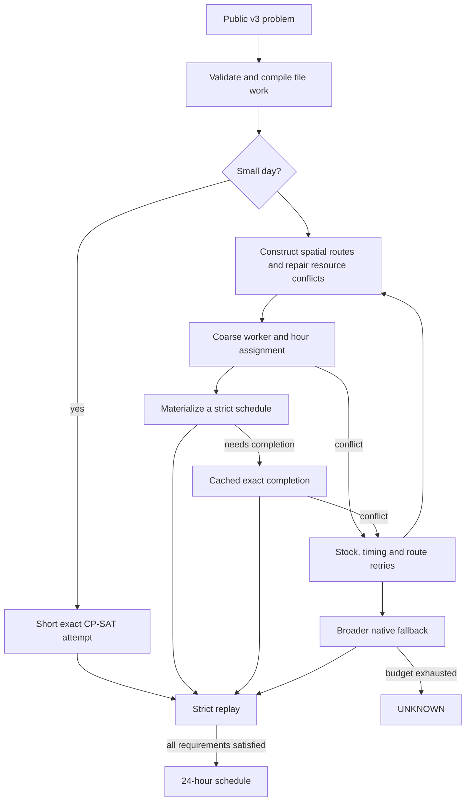

# How the scheduler works

The scheduler solves a fixed-day feasibility problem. The caller has already
chosen farm work and economic requirements. The scheduler chooses who carries
out that work, when, and how they travel and exchange cargo. It stops when it
has one valid result. Heuristic scores guide search; they are not required
objectives and do not establish feasibility.

## 1. Compile fixed work

Tile-work entries become atomic operations with per-tile predecessors, resource
inputs, seed consumption, exact outputs and spatial coordinates. Bundles keep
related operations together where useful. Tile transition graphs describe
legal progress through each required sequence and its exact deterministic
successor state. Worker profiles describe hire release time and possible spawn
locations. Shared stock and cumulative availability deadlines remain part of
the problem throughout the pipeline.

The native entry rejects malformed v3 input before searching. For at most 12
tasks and at most four workers, it first tries an exact solve for up to 600 ms
within the remaining total budget.

## 2. Construct and repair routes

The constructor groups nearby tile bundles into worker routes using the native
PyVRP search core and our own route/resource repair. A route carries cumulative
cargo: production may serve later consumption, but never the reverse. Shared
resources and seeds are also considered across routes. Scarcity, workload,
predecessor timing and deadlines affect candidate scores.

For portfolio budgets from one through four seconds, the release first gives
RegretFast up to two seconds (at most half the total). After failure it may spend
up to1.5 seconds constructing one fewer route. It removes only the last
chronological hire, restores that hire at its original order slot as an idle
worker, and strictly replays the restored contract. Remaining time goes to the
established portfolio below. Longer calls keep the established order because
the early reservation regressed a12-second cold control.

Before constructing jobs, a selected sale producer followed by consumption of
its output on the same tile can be exchanged for an unused independent producer
with enough output and a feasible delivery deadline. This corrects false return
trips in the route score. Actual timed sales and retained inventory constraints
remain unchanged and are enforced by completion and replay.

The quick portfolio tries two rounds and up to eight variants per round. The
last four change only seed readiness assignment and are skipped when they are
equivalent to the first four. It starts
with 64 routing iterations and increases the second round's count. Variants
change shared-resource/shared-seed treatment, balance repair, delivery grouping
and construction jitter. Construction respects both its iteration count and the
remaining day budget. The route repair allowance is 150 ms. Individual search
iterations and model construction are not interruptible, so time limits are
soft. It stops trying variants after an accepted schedule.

Partial selection of promising neighborhood moves replaces sorting entire
candidate lists. Compact native kernels and contiguous representations reduce
Python orchestration, repeated allocation and ranking work. These heuristics
produce proposals, not executable schedules.

After two cheap constructor attempts on bounded-storage problems, the current
source also tries a cold beam over useful jobs. It tries five constructors first
when planned purchases may need additional shed space. A job normally contains a tile's complete
action sequence; early delivery deadlines can split it into prefixes. Branches
insert a job between existing jobs on a worker route. Manhattan distance prices
travel. Equivalent worker-label permutations are removed from the beam.
An urgent delivery job is split into individual operations when at most one
worker could finish it alone. This permits same-hour feed/harvest handoffs.

The score includes route duration, deadlines, cross-worker tile precedence,
initial input needs after local wheat/fertilizer reuse, and the returns needed
to replenish stock consumed by workers before sales. Relocation and exchange
of complete jobs improve the best partition. These estimates remain heuristics;
the final timing model may choose different spawn positions, pickups and returns.
Its shared-stock checks and strict replay decide acceptance.

Alternative orderings also match seed and purchased-input quantities to the
latest possible planting and pickup times allowed by the route. This avoids
grouping jobs that collectively require purchases too early. The original
score remains in variants0/2/3; the purchase-aware variant1 follows the first
two orders (0/2/1/3). Complete unpolished routes with low estimated cost may be
completed first. Only that first raw candidate gets estimated task-time hints;
other candidates use ordinal hints. Lowering a route score does not guarantee
easier completion.

The bounded-storage attempt uses at most four seconds of the remaining solve
budget, width32, up to500ms of local improvement per ordering, and two candidates
per ordering with up to2s per timed completion. Two-action job fragments receive
up to3s between legacy constructor rounds. A one-second resource-first attempt
omits selected early-return trips from its ranking while preserving all actual
delivery constraints. The older route and exact backends
remain available. A two-second complementary regret constructor follows the
whole-job and resource-first attempts. It chooses the job whose next-best
worker choices are most expensive, using regret-2 and regret-3 orderings. This
allows tight jobs to claim scarce route space before flexible jobs.
After ordinary regret candidates fail, unused time in that same two-second
allowance can remove and reinsert several jobs. After the fragment retry,
a separate reconstruction attempt receives at most two remaining seconds.
It ranks routes without selected early-return trips and caps each exact
completion at400ms to try several partitions. Actual delivery and retained
inventory constraints remain unchanged.

Optional depot-visit dynamic programming, longer route exchanges and sorting
completions by route cost alone remain disabled in main.
These working-source settings are under regression testing;
the packaged V30 manifest remains a historical frozen release.

## 3. Assign worker identities and hours

Coarse CP-SAT models assign work and hours while respecting route structure,
release profiles, tile precedence, resource availability and returns. Identical
spawn/release groups allow flexible route-to-worker assignments rather than
an unnecessarily fixed route order. Readiness and purchased-stock checks stop
the model from borrowing seeds or cargo from a future purchase.

The quick completion allowance is 1.5 s, including a coarse allowance up to
900 ms and an exact completion call capped at 600 ms. CP-SAT runs in native C++;
Python is not constructing these models at inference time.

## 4. Materialize and exactly complete

V30 can construct movement, pickups, farm work, returns and deposits directly
from a sufficiently detailed coarse solution. It strictly replays this candidate
before accepting it. If direct materialization cannot produce a valid schedule,
the exact backend completes the candidate's assignments and timing constraints.
Reusable model structure is cached within the solve call.

Job completion first tries a cheap stock and terminal proposal. A concrete
materialization failure can trigger a stronger capacity model. It tracks shed
load through each worker and market step, and automatic night deposits in
worker order. When losses are required, it also tracks cargo insertion order;
the engine does not deposit cargo in item-number order. No-loss contracts omit
the unnecessary night allocation chain but retain daytime capacity checks.

Purchase pressure is computed separately for each item. Selling newly produced
goods cannot cancel stock of other items already occupying the shed. On these
days, the stronger model may increase quantities on existing pickup visits.
A bounded repair can also enlarge an existing pickup in a completed schedule
to make room for a purchase. Every such change must pass exact replay.

When cheap repair rejects a complete lossless proposal, main may optimize stock
transfers while holding every path and work time fixed. It chooses quantities
on existing pickups/deposits and may use idle hours already at a shed-access
tile for an additional transfer. The model follows cargo insertion order,
daytime clipping, DROP and night deposits. Main spends at most200ms on this
model across all rejected proposals, within the existing day budget. Strict
replay still decides acceptance; infeasible fixed paths do not reject the day.

Materialization follows selected one-item return quantities with PLACE. A
multi-item DROP empties all modeled cargo and cannot cross an input's production
or pickup and its later consumer. Goods returned early are credited so later
planned returns do not demand them again. A relaxed routing candidate that fails the
actual storage contract is rejected without stopping the remaining portfolio.

Useful failed proposals can receive bounded timing/geometry retries, including
real stock checks. After quick variants, a fixed-work repair portfolio receives
up to four seconds. If necessary, a broader native portfolio uses the remaining
budget for constructor alternatives, semantic conflict repairs and exact search.
An exact failure for fixed owners or routes rejects that candidate only.
The current fallback experiment reserves up to 600ms of the remaining day
budget for completion instead of spending all of it on a route proposal.

On bounded contracts, if whole-job candidates all exceed their estimated timing
limits and ordinary regret search fails, the stronger resource constructor gets
a four-second attempt before fragmented-job and final reconstruction searches.
This recovers cases where later fallbacks were starved of construction time.
The estimate only changes method priority; exact replay still decides acceptance.

The current shared-resource priority experiment also records which cheap
constructor families produced complete partitions. If shared-resource
construction succeeded while plain construction did not, a stronger shared
attempt follows the ordinary and fixed-work retries. It receives up to eight
seconds including construction and completion; its first fixed-ownership check
gets at most one second so semantic route repairs can run. This recovers all
three previously timed-out Crop controls, improving the 12-second slow-case
audit from 239/242 to 242/242 while retaining 323/323 development cases.

An optional route-recombination experiment selects whole worker routes from our
own generated partitions, covering each job exactly once. Its small CP-SAT model
minimizes route cost, then the ordinary timing and inventory completion checks
the mixed partition. It is disabled in the main and public regret profiles.

## 5. Strict replay decides acceptance

The final replay checks every requested worker action, worker ordering, movement,
tile-work sequence and exact produced quantity; legal cargo and seed use;
hire/spawn and land timing; every availability withdrawal; and all deterministic
end tiles and exact terminal inventories. No returned schedule is accepted
solely because CP-SAT or a route score reports success.

Historical benchmark acceptance also required an independent Python hourly
inventory ledger. The packaged benchmark runner retains this check with a
standard-library-only v3 task extractor, plus the native auditor. The ledger is
an inventory cross-check, not a substitute for tile and movement replay.

## Invariants that must survive changes

1. Required work is ordered per tile. Different workers can cooperate on it.
2. Wheat and fertilizer are fungible, but must be in the acting worker's cargo.
   A producing animal or crop is not permanently paired with a consumer.
3. Seeds are shared and dated; purchases after hour H's work cannot serve that work.
4. Availability consumes inventory once. The same goods cannot serve two withdrawals.
5. Deposits and pickups can transfer goods between workers; both cost worker hours.
6. Hire spawn occupancy depends on current worker positions, and order within an
   hour matters for both worker actions and purchases.
7. End cargo transfers automatically; early deadlines still require timely deposits.
8. The exact replay contract, rather than an observed replay pattern, decides legality.

This is a hybrid route-search and CP-SAT implementation. There is no evidence
establishing which exact algorithm Crop Dusta itself used. Observed route
patterns motivated hypotheses; they are not proofs of universal structure.

Source entry: `src/components/native_quick_portfolio_v30/quick.cpp`. Construction
starts in `native_constructor_generic_v2`; coarse/materialized and exact models
are in `native_*_screen` and `native_*_exact`; the public replay/schema are in
`native_exact_domains/solver` and `resource_portfolio_order_v2/solver/include`.
