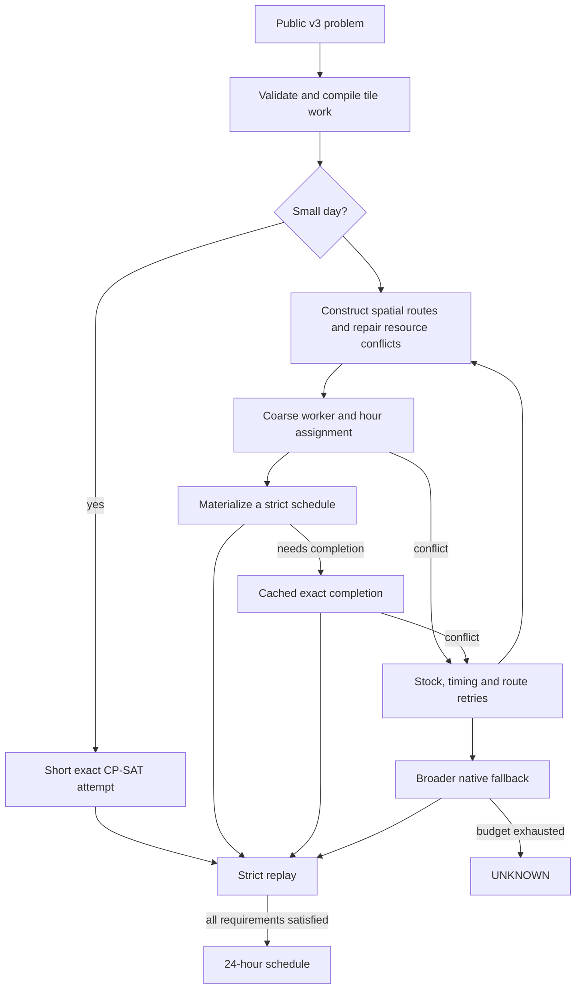

# How the scheduler works

The scheduler solves a fixed-day feasibility problem. The caller has already
chosen farm work and economic requirements. The scheduler chooses who carries
out that work, when, and how they travel and exchange cargo. It stops when it
has one valid result. Heuristic scores guide search; they are not required
objectives and do not establish feasibility.

## 1. Compile fixed work

Tile-work entries become atomic operations with per-tile predecessors, resource
inputs, seed consumption, exact outputs and spatial coordinates. Bundles keep
related operations together where useful. Tile transition graphs describe
legal progress through each required sequence and its exact deterministic
successor state. Worker profiles describe hire release time and possible spawn
locations. Shared stock and cumulative availability deadlines remain part of
the problem throughout the pipeline.

The native entry rejects malformed v3 input before searching. For at most 12
tasks and at most four workers, it first tries an exact solve for up to 600 ms
within the remaining total budget.

## 2. Construct and repair routes

The constructor groups nearby tile bundles into worker routes using the native
PyVRP search core and our own route/resource repair. A route carries cumulative
cargo: production may serve later consumption, but never the reverse. Shared
resources and seeds are also considered across routes. Scarcity, workload,
predecessor timing and deadlines affect candidate scores.

The quick portfolio tries two rounds and eight variants per round. It starts
with 64 routing iterations and increases the second round's count. Variants
change shared-resource/shared-seed treatment, balance repair, delivery grouping
and construction jitter. Each route-search/repair allowance is 150 ms, bounded
by total remaining time. It stops trying variants after an accepted schedule.

Partial selection of promising neighborhood moves replaces sorting entire
candidate lists. Compact native kernels and contiguous representations reduce
Python orchestration, repeated allocation and ranking work. These heuristics
produce proposals, not executable schedules.

## 3. Assign worker identities and hours

Coarse CP-SAT models assign work and hours while respecting route structure,
release profiles, tile precedence, resource availability and returns. Identical
spawn/release groups allow flexible route-to-worker assignments rather than
an unnecessarily fixed route order. Readiness and purchased-stock checks stop
the model from borrowing seeds or cargo from a future purchase.

The quick completion allowance is 1.5 s, including a coarse allowance up to
900 ms and an exact completion call capped at 600 ms. CP-SAT runs in native C++;
Python is not constructing these models at inference time.

## 4. Materialize and exactly complete

V30 can construct movement, pickups, farm work, returns and deposits directly
from a sufficiently detailed coarse solution. It strictly replays this candidate
before accepting it. If direct materialization cannot produce a valid schedule,
the exact backend completes the candidate's assignments and timing constraints.
Reusable model structure is cached within the solve call.

Useful failed proposals can receive bounded timing/geometry retries, including
real stock checks. After quick variants, a fixed-work repair portfolio receives
up to four seconds. If necessary, a broader native portfolio uses the remaining
budget for constructor alternatives, semantic conflict repairs and exact search.
An exact failure for fixed owners or routes rejects that candidate only.

## 5. Strict replay decides acceptance

The final replay checks every requested worker action, worker ordering, movement,
tile-work sequence and exact produced quantity; legal cargo and seed use;
hire/spawn and land timing; every availability withdrawal; and all deterministic
end tiles and exact terminal inventories. No returned schedule is accepted
solely because CP-SAT or a route score reports success.

Historical benchmark acceptance also required an independent Python hourly
inventory ledger. The packaged benchmark runner retains this check with a
standard-library-only v3 task extractor, plus the native auditor. The ledger is
an inventory cross-check, not a substitute for tile and movement replay.

## Invariants that must survive changes

1. Required work is ordered per tile. Different workers can cooperate on it.
2. Wheat and fertilizer are fungible, but must be in the acting worker's cargo.
   A producing animal or crop is not permanently paired with a consumer.
3. Seeds are shared and dated; purchases after hour H's work cannot serve that work.
4. Availability consumes inventory once. The same goods cannot serve two withdrawals.
5. Deposits and pickups can transfer goods between workers; both cost worker hours.
6. Hire spawn occupancy depends on current worker positions, and order within an
   hour matters for both worker actions and purchases.
7. End cargo transfers automatically; early deadlines still require timely deposits.
8. The exact replay contract, rather than an observed replay pattern, decides legality.

This is a hybrid route-search and CP-SAT implementation. There is no evidence
establishing which exact algorithm Crop Dusta itself used. Observed route
patterns motivated hypotheses; they are not proofs of universal structure.

Source entry: `src/components/native_quick_portfolio_v30/quick.cpp`. Construction
starts in `native_constructor_generic_v2`; coarse/materialized and exact models
are in `native_*_screen` and `native_*_exact`; the public replay/schema are in
`native_exact_domains/solver` and `resource_portfolio_order_v2/solver/include`.
