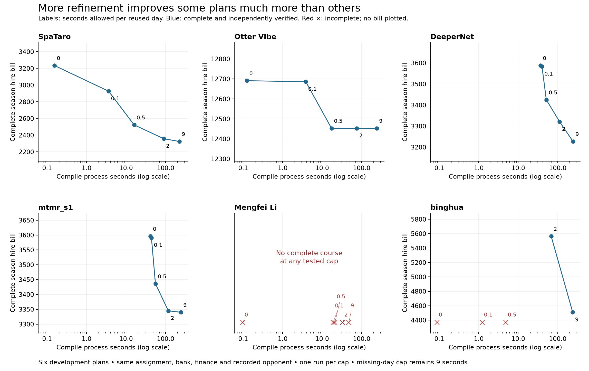

# Profiling and implementation learnings

- Compare against equal-budget fixed-placement workforce search, retaining its best witness.
- Full physical endpoints alone do not certify funding, storage or timed sales.
- Check source request versus successful action/quantity before extracting tasks.
- Full season continuity and the 719-transition horizon are mandatory.
- Model outputs are not feasibility certificates; large additions remain a known estimator weakness.
- Use source family splits and complete end-to-end timing. Count unresolved and failed complete plans.
- Initial machine: 28 logical CPUs, 125 GiB RAM, about 116 GiB available. Other user processes are active. Start four single-threaded benchmark jobs and two build jobs; record peak RSS.

## Exact reuse

All timings are from this machine during the session. Bank construction is separate. Prediction timings are supporting measurements; they are not whole-game certificates.

| Workload | Uncached/text | Cached/packed | Correctness evidence |
|---|---:|---:|---|
| 4,608 lifetime assignments, 18 synthetic plans | 10.0508 s | 5.32917 s | Every prediction identical |
| 1,536 assignments with real fixed finance | 11.3975 s | 8.7116 s | Every prediction identical |
| 1,536 assignments on six supported final inputs | 10.06486 s | 6.86373 s | Every prediction identical |
| 512 assignments on two repeated-service inputs | 2.85878 s | 2.19956 s | Every prediction identical |
| 18 paired synthetic full compiles, mean process time | 0.69060 s | 0.05702 s | 36 full engine and later independent calendar checks |

The 269-entry bank is 422,757 bytes. Its load-only comparison is 0.482 to 0.0027 seconds. The larger real development bank has 1,212 entries and is 3,977,383 bytes: load time 2.415 to 0.04435 seconds, with all 1,440 validation lookups identical. Returned bank schedules always strictly replay against the new contract.

Small banks have less loading cost to remove. In the first eight-real-input format panel, all 48 executions and calendars complete, every paired action/outcome matches, and mean compile-plus-independent-verification time falls from 0.16173 to 0.13572 seconds, about 16%. That launcher includes Python's polling wait for a subprocess timeout; do not compare those absolute times directly with the later blocking-wait panel below.

The final packing-cost check runs three interleaved repeats per bank with two workers. All twelve packed files are byte-identical to their existing counterparts. Packing includes loading existing certificates, writing the bank and comparing strict lookup results on the validation manifest. It still excludes discovering those source certificates.

| Entries | Mean pack + validation | Mean saved time per load | Approximate loads to recover packing cost |
|---|---:|---:|---:|
| 9 | 0.0280 s | 0.0106 s | 3 |
| 30 | 0.0467 s | 0.0162 s | 3 |
| 269 | 0.6610 s | 0.4764 s | 2 |
| 1,212 | 2.2900 s | 1.0819 s | 3 |

The last column is the ceiling of the first timing divided by the second. It is an approximate load-only calculation: packing uses external process wall time, while saved loading uses internal timers. Absolute load times differ from the earlier panel with machine/file-cache conditions. Reuse a packed bank across evaluations; packing a fresh bank for just one use does not pay for itself in this check. Peak RSS is below 48 MiB. See `runs/bank_amortization_001/SUMMARY.json`.

## Repeated lifetime compilation

The file loader originally called the biological oracle for every record. Eight profiled real plans have 235–256 records but only 98–111 distinct full specifications. Reusing each exact specification within one load reduces mean biological loading across the eight inputs from 23.80 to 10.22 milliseconds. Finance-source loading remains about 18 milliseconds; a small packed bank loads in about 0.5 milliseconds.

The equality check compares every field of the generated states and actions against fresh oracle compilation: 75 plans, 15,715 lifetimes, 471,450 daily records. Those plans require only 5,430 unique oracle calls. Repeated-service and legacy invalid-input checks also pass.

The follow-up whole-course panel interleaves five repeats of all three variants across eight real incumbents, four workers, zero solver queries. It uses a blocking child wait to avoid timeout polling overhead. All 120 courses and independent calendars complete; every paired executable action, bill and both players' cash is identical.

| Variant | Mean compile + verify | Median | p95 | Compilation CPU, 40 runs | Max compile RSS |
|---|---:|---:|---:|---:|---:|
| Old loader, text bank | 0.13190 s | 0.13151 s | 0.14308 s | 4.11 s | 30,460 KiB |
| Old loader, packed bank | 0.11719 s | 0.11553 s | 0.12762 s | 3.57 s | 30,324 KiB |
| Reused lifetime compilation, packed bank | 0.10655 s | 0.10606 s | 0.12437 s | 3.16 s | 30,084 KiB |

The combined change saves 19.2% of measured compile-plus-verification wall time and 23.1% of compilation CPU. The CPU column excludes the separately run calendar checker; the wall column includes it. The 19.2% full wall reduction remains below the provisional 20% target, so retain this as a scoped exact improvement rather than rounding it into a gate pass.

## Refinement budget is a quality tradeoff

Six development replay plans use the same original assignment, fixed development bank, source financial commitments and recorded opponent. Only the time allowed to refine an existing witness changes. A day without a witness keeps a nine-second budget and three-second query cap. One run per cap; wall-limited solver variability remains.

| Warm-day cap | Complete and calendar verified | CPU over all six attempts | Highest process RSS |
|---|---:|---:|---:|
| 0 s | 4/6 | 78.50 s | 87,068 KiB |
| 0.1 s | 4/6 | 111.65 s | 88,580 KiB |
| 0.5 s | 4/6 | 166.21 s | 90,664 KiB |
| 2 s | 5/6 | 495.46 s | 116,872 KiB |
| 9 s | 5/6 | 1,239.05 s | 120,704 KiB |

| Team | 0 s bill | 0.1 s bill | 0.5 s bill | 2 s bill | 9 s bill |
|---|---:|---:|---:|---:|---:|
| SpaTaro | 3,235 | 2,927 | 2,523 | 2,358 | 2,324 |
| Otter Vibe | 12,691 | 12,686 | 12,453 | 12,453 | 12,453 |
| DeeperNet | 3,588 | 3,583 | 3,425 | 3,321 | 3,227 |
| mtmr_s1 | 3,596 | 3,591 | 3,436 | 3,345 | 3,340 |
| Mengfei Li | incomplete | incomplete | incomplete | incomplete | incomplete |
| binghua | incomplete | incomplete | incomplete | 5,564 | 4,509 |

At two versus nine seconds, common complete bills total 27,041 versus 25,853, a 4.6% increase despite about 60% less total CPU. Excluding binghua, the increase is 133 over 21,344, about 0.6%; that exclusion is descriptive and was not used to select a default. At smaller caps, fast failures must not be mistaken for efficient complete solutions. Preserve complete incumbents.

## Reproducibility

`RESULTS.json` gives the source report hashes and distribution summaries. The input profile, direct oracle check and real-course before/after binaries are preserved under `runs/input_loading_profile_001/`, `runs/life_compile_reuse_001/` and `runs/life_compile_reuse_benchmark_001/`. The original frozen final placement binaries remain unchanged.

## Where bounded search spends time

`research/search_time_001.json` describes the original 180-second search runs, without changing their proposals or outcomes. In the six supported frozen final cases, proposal generation takes 5.55 seconds total, about 0.5% of recorded tool time. Placement day queries take 331.10 seconds and unchanged-layout queries 713.83 seconds, together about 97%. All 44 placement and 52 unchanged point queries remain UNKNOWN. No changed full course is attempted because no changed point query succeeds.

The two distinct-family extension runs have a different bottleneck. Proposal generation takes 2.08 seconds, while changed-course compilation takes 299.27 seconds, about 83% of recorded tool time. Five placement points are feasible and two remain UNKNOWN, but these point certificates do not produce an accepted placement gain. More candidate generation is not the main missing piece in either panel.

These are sums over dependent cases and queries, not an independent-family estimate. Faster loading helps repeated whole-course evaluation; it cannot remove the dominant unsuccessful routing work in these bounded searches.
